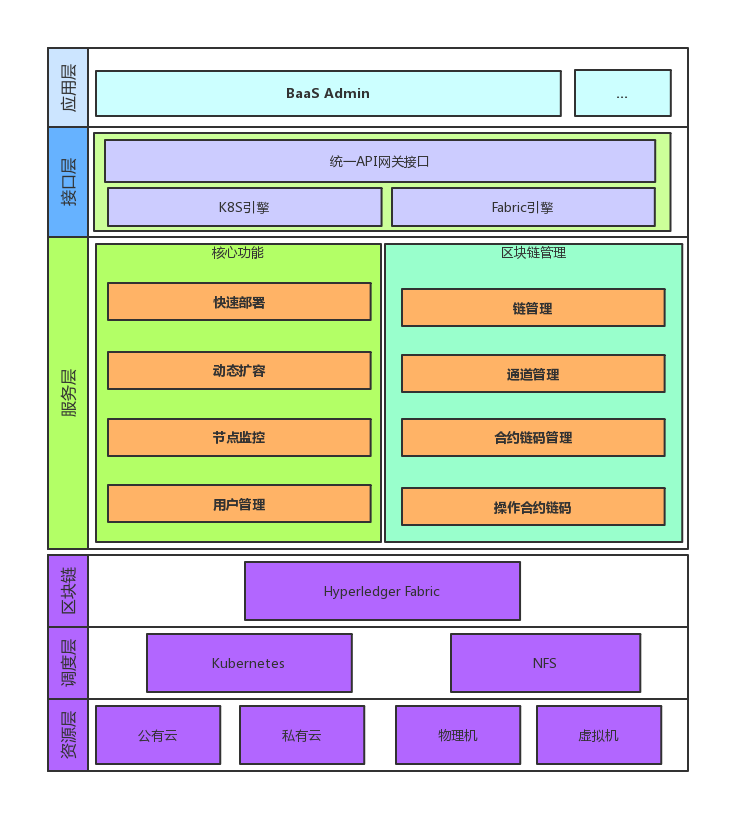
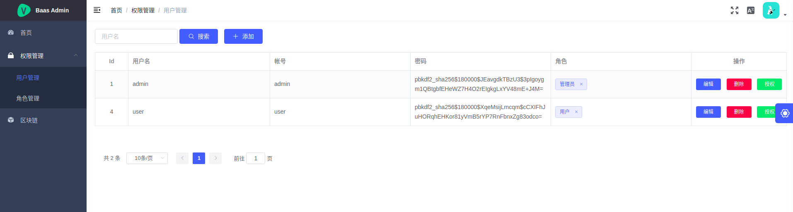
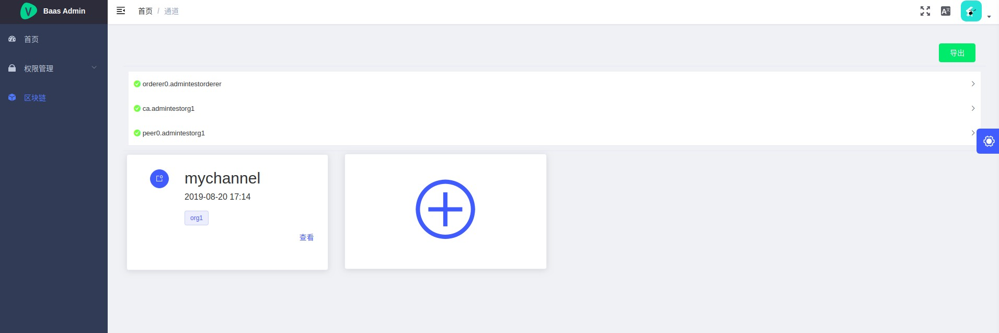
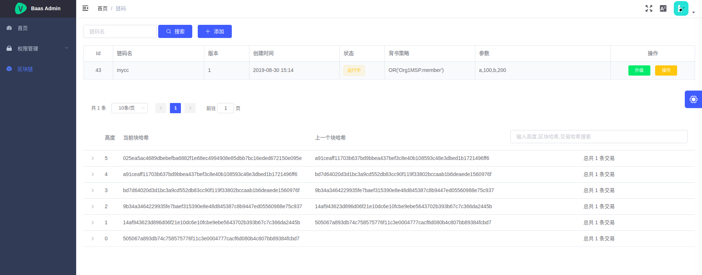

# baasmanager


### 基于K8S平台的区块链即服务（Blockchain as a Service） 
### 整体功能
#### 动态创建fabric
- [x] solo
- [x] kafka
- [ ] etcdraft
#### 区块链监控
- [x] 区块链首页统计分析 
- [ ] 区块链浏览器 
#### 区块链资源
- [ ] 动态扩容
- [x] 释放 
### 主要目录结构
* baas-kubecluster 
  k8s集群，基于flannel网络，安装dashboard插件，还有其余插件等 (一个简单的k8s集群)
* baas-nfsshared  
  其会生成baas-artifacts，baas-fabric-data，baas-k8s-config目录，baas-artifacts为存放生成的证书文件，baas-fabric-data为fabric网络映射出来的数据，baas-k8s-config为生成的k8s yaml定义文件  
* baas-template  
  fabric k8s的模板文件，用于生成baas-k8s-config下的文件  
* baas-fabricengine  
  用于生成 baas-nfs-shared的文件即目录结构和执行fabric操作
* baas-kubeengine  
  config文件是k8s master的$HOME/.kube/config文件，用于k8s client链接k8s集群，将baas-k8s-config下的在k8s集群创建启动  
* baas-gateway 
  统一api网关管理，调用入口
* baas-frontend  
  baas admin 前端
### 架构图

### 数据流图

### 页面








### 部署步骤（简单3台centos虚拟机包含一台nfs，两台k8s集群）
* 以k8s-cluster搭建k8s集群
* k8s-master 和 baas-kubeengine 部署同一台centos
  * 将k8s master的$HOME/.kube/config文件 替换 kubeconfig/config
  * 修改配置文件 keconfig.yaml  
* nfs服务器和 baas-fabricengine 部署同一台centos
  * 创建baas根目录
    * 复制 baas-template到其下
    * 创建nfs共享目录 baas-nfsshared 
  * 修改配置文件 feconfig.yaml  
  * nfs安装和配置
    * yum -y install nfs-utils rpcbind
    * id (查看当前用户的uid和gid)
    * vim /etc/exports (添加配置,相应修改)  
      ```
      /baas根目录/baas-nfs-shared 192.168.1.0/24(rw,sync,insecure,anonuid=当前用户的uid,anongid=当前用户的gid)
      ```
    * exportfs -r (配置生效)
    * service rpcbind start &&  service nfs start (启动rpcbind、nfs服务)
  * 启动 baas-fabricengine 
* baas-gateway 随便部署到其中一台centos
  * 安装mysql 
    ```
    docker run -p 3306:3306 --name apimysql \
               -e MYSQL_ROOT_PASSWORD=123456 \
               -d mysql:5.7 
    ```
  * 通过 mysql.sql 初始化 mysql,对应修改dbconfig.yaml
  * 修改配置文件 gwconfig.yaml  
  * 运行 baas-gateway
* baas-frontend 随便部署到其中一台centos
  * npm run build:prod 打包
  * 用nginx部署，把打包生成的dist文件夹复制并重命名/usr/share/nginx/baas
  * 配置nginx.conf反向代理
    ```
    user www-data;
    worker_processes auto;
    pid /run/nginx.pid;
    
    events {
    	worker_connections 768;
    	# multi_accept on;
    }
    
    http {
        include       mime.types;
        default_type  application/octet-stream;
    
        log_format  logformat  '$remote_addr - $remote_user [$time_local] "$request" '
                          '$status $body_bytes_sent "$http_referer" '
                          '"$http_user_agent" "$http_x_forwarded_for" '
                          '"[$request_time]" "[$upstream_response_time]" '
                          '"[$connection]" "[$connection_requests]" '
                          '"$http_imei" "$http_mobile" "$http_type" "$http_key" "$cookie_sfpay_jsessionid"';
        access_log  /var/log/nginx/access.log logformat;
    
    
        sendfile        on;
        #tcp_nopush     on;
        underscores_in_headers on;
    
        keepalive_timeout  65;
        proxy_connect_timeout 120;
        proxy_read_timeout 120;
        proxy_send_timeout 60;
        proxy_buffer_size 16k;
        proxy_buffers 4 64k;
        proxy_busy_buffers_size 128k;
        proxy_temp_file_write_size 128k;
        proxy_temp_path /tmp/temp_dir;
        proxy_cache_path /tmp/cache levels=1:2 keys_zone=cache_one:200m inactive=1d max_size=30g;
    
        client_header_buffer_size 12k;
        open_file_cache max=204800 inactive=65s;
        open_file_cache_valid 30s;
        open_file_cache_min_uses 1;
    
    
    
        gzip  on;
        gzip_types       text/plain application/x-javascript text/css application/xml text/javascript application/x-httpd-php image/jpeg image/gif image/png image/jpg;
        # apimanager地址
        upstream baasapi {
            server 127.0.0.1:6991;
        }
    
       
        # HTTP server
        #
        server {
            listen       8080;
            server_name  baasadmin;
    
            location /nginx_status {
                    stub_status on;
                    access_log off;
            }
            location /api/{
                proxy_pass  http://baasapi/api/;
                proxy_set_header  X-Real-IP  $remote_addr;
                proxy_set_header Host $host;
    
            }
            location /dev-api/{
                proxy_pass  http://baasapi/api/;
                proxy_set_header  X-Real-IP  $remote_addr;
                proxy_set_header Host $host;
    
            }
            location /stage-api/{
                proxy_pass  http://baasapi/api/;
                proxy_set_header  X-Real-IP  $remote_addr;
                proxy_set_header Host $host;
    
            }
    
            location / {
                root   baas;
                index  index.html index.htm;
            }
    
            location ~ ^/favicon\.ico$ {
                root   baas;
            }
             
        }
    }
    ```
  * 启动nginx
    ``` 
    sudo service nginx start
    ```
  * 访问 http://ip:8080 


